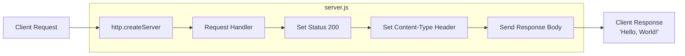
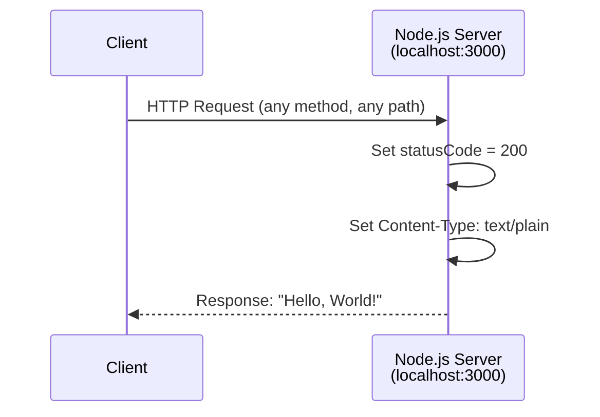

# hello_world


A minimal HTTP server built with Node.js for Backprop integration testing. This project serves as a simple scaffold demonstrating a basic "Hello, World!" HTTP server using Node.js built-in modules with zero external dependencies.

---

## Table of Contents

- [Features](#features)
- [Prerequisites](#prerequisites)
- [Installation](#installation)
- [Usage](#usage)
- [API Reference](#api-reference)
- [Deployment Guide](#deployment-guide)
- [Configuration](#configuration)
- [Code Explanation](#code-explanation)
- [Troubleshooting](#troubleshooting)
- [License](#license)
- [Author](#author)

---

## Features

- **Minimal HTTP Server**: Built using Node.js built-in `http` module
- **Zero External Dependencies**: No npm packages required - runs with pure Node.js
- **Simple Response**: Returns "Hello, World!" for all incoming requests
- **Localhost Binding**: Configured for local development on `127.0.0.1:3000`
- **Lightweight**: Single file implementation (~14 lines of code)
- **Cross-Platform**: Works on Windows, macOS, and Linux

---

## Prerequisites

Before running this project, ensure you have the following installed:

| Requirement | Version | Notes |
|-------------|---------|-------|
| **Node.js** | LTS (20.x, 22.x, or 24.x recommended) | [Download Node.js](https://nodejs.org/) |
| **npm** | 7.x or later | Included with Node.js |

**Verify your installation:**

```bash
node --version
npm --version
```

---

## Installation

### 1. Clone the Repository

```bash
git clone <repository-url>
cd hao-backprop-test
```

### 2. Verify Files

Ensure `server.js` exists in the project directory:

```bash
ls server.js
```

### 3. No Dependencies Required

This project has **zero external dependencies**. No `npm install` is needed!

---

## Usage

### Starting the Server

Run the server using Node.js:

```bash
node server.js
```

**Expected Output:**

```
Server running at http://127.0.0.1:3000/
```

### Testing the Server

#### Using cURL

```bash
curl http://127.0.0.1:3000/
```

**Expected Response:**

```
Hello, World!
```

#### Using a Web Browser

Open your browser and navigate to:

```
http://127.0.0.1:3000/
```

You should see "Hello, World!" displayed in the browser.

### Stopping the Server

Press `Ctrl+C` in the terminal where the server is running.

---

## API Reference

### Endpoint Specification

| Attribute | Value |
|-----------|-------|
| **URL** | `http://127.0.0.1:3000/` |
| **Methods** | All HTTP methods (GET, POST, PUT, DELETE, etc.) |
| **Paths** | All paths (`/`, `/any/path`, etc.) |
| **Response Status** | `200 OK` |
| **Content-Type** | `text/plain` |
| **Response Body** | `Hello, World!\n` |

### Request/Response Example

**Request:**

```http
GET / HTTP/1.1
Host: 127.0.0.1:3000
```

**Response:**

```http
HTTP/1.1 200 OK
Content-Type: text/plain
Date: <current-date>
Connection: keep-alive

Hello, World!
```

### cURL Examples

```bash
# GET request
curl http://127.0.0.1:3000/

# POST request (same response)
curl -X POST http://127.0.0.1:3000/

# Request with verbose output
curl -v http://127.0.0.1:3000/

# Request any path (same response)
curl http://127.0.0.1:3000/any/path/here
```

---

## Deployment Guide

### Production Considerations

#### 1. Enable External Access

By default, the server binds to `127.0.0.1` (localhost only). To allow external connections, modify `server.js`:

```javascript
// Change from:
const hostname = '127.0.0.1';

// To:
const hostname = '0.0.0.0';
```

> **Security Warning:** Binding to `0.0.0.0` exposes the server to all network interfaces. Ensure proper firewall rules are in place.

#### 2. Port Configuration

Change the port if needed (e.g., for production use port 80 or 8080):

```javascript
const port = 8080;
```

#### 3. Process Management

For production deployments, use a process manager to ensure the server stays running:

**Using PM2:**

```bash
# Install PM2 globally
npm install -g pm2

# Start the server with PM2
pm2 start server.js --name "hello-world"

# View running processes
pm2 list

# View logs
pm2 logs hello-world

# Stop the server
pm2 stop hello-world
```

**Using systemd (Linux):**

Create a service file at `/etc/systemd/system/hello-world.service`:

```ini
[Unit]
Description=Hello World Node.js Server
After=network.target

[Service]
ExecStart=/usr/bin/node /path/to/server.js
Restart=always
User=www-data
Environment=NODE_ENV=production

[Install]
WantedBy=multi-user.target
```

Then enable and start the service:

```bash
sudo systemctl enable hello-world
sudo systemctl start hello-world
```

#### 4. Protocol Limitations

> **Note:** This server uses HTTP only. For HTTPS support, consider using:
> - A reverse proxy (nginx, Apache)
> - Node.js `https` module with SSL certificates
> - Cloud provider load balancers with SSL termination

---

## Configuration

### Available Configuration Options

| Option | Default Value | Type | Description |
|--------|---------------|------|-------------|
| `hostname` | `'127.0.0.1'` | `string` | IP address to bind the server |
| `port` | `3000` | `number` | Port number for the server |

### Modifying Configuration

Configuration is set directly in `server.js`. To customize:

1. Open `server.js` in your editor
2. Modify the constants at the top of the file:

```javascript
const hostname = '127.0.0.1';  // Change to '0.0.0.0' for external access
const port = 3000;              // Change to desired port number
```

3. Save and restart the server

### Common Configuration Scenarios

| Scenario | hostname | port |
|----------|----------|------|
| Local development | `'127.0.0.1'` | `3000` |
| Docker container | `'0.0.0.0'` | `3000` |
| Production (direct) | `'0.0.0.0'` | `80` or `8080` |
| Behind reverse proxy | `'127.0.0.1'` | `3000` |

---

## Code Explanation

### Architecture Overview

The server follows a simple request-response architecture using Node.js's built-in `http` module.



### Request-Response Flow



### Code Walkthrough

#### 1. Module Import

```javascript
const http = require('http');
```

Imports the Node.js built-in `http` module, which provides functionality to create HTTP servers and make HTTP requests.

#### 2. Configuration Constants

```javascript
const hostname = '127.0.0.1';
const port = 3000;
```

- `hostname`: The IP address the server binds to. `127.0.0.1` restricts access to localhost only.
- `port`: The port number the server listens on. `3000` is a common development port.

#### 3. Server Creation

```javascript
const server = http.createServer((req, res) => {
  res.statusCode = 200;
  res.setHeader('Content-Type', 'text/plain');
  res.end('Hello, World!\n');
});
```

- `http.createServer()`: Creates a new HTTP server instance
- The callback function `(req, res)` is called for every incoming request:
  - `req` (IncomingMessage): Contains request information (method, headers, URL)
  - `res` (ServerResponse): Used to send the response back to the client
- `res.statusCode = 200`: Sets HTTP status to "200 OK"
- `res.setHeader()`: Sets the Content-Type header to indicate plain text response
- `res.end()`: Sends the response body and signals the response is complete

#### 4. Server Startup

```javascript
server.listen(port, hostname, () => {
  console.log(`Server running at http://${hostname}:${port}/`);
});
```

- `server.listen()`: Binds the server to the specified hostname and port
- The callback function executes once the server is ready to accept connections
- Logs a confirmation message with the server URL

---

## Troubleshooting

### Common Issues and Solutions

| Issue | Error Message | Cause | Solution |
|-------|---------------|-------|----------|
| **Port in use** | `EADDRINUSE: address already in use :::3000` | Another process is using port 3000 | Kill the other process or change the port in `server.js` |
| **Connection refused** | `Connection refused` | Server is not running | Start the server with `node server.js` |
| **Cannot access from other machines** | Connection timeout | Server bound to localhost only | Change `hostname` to `'0.0.0.0'` in `server.js` |
| **Permission denied** | `EACCES: permission denied` | Trying to use a privileged port (< 1024) | Use a port > 1024 or run with elevated privileges |

### Finding and Killing Processes on Port 3000

**Linux/macOS:**

```bash
# Find process using port 3000
lsof -i :3000

# Kill the process
kill -9 <PID>
```

**Windows:**

```bash
# Find process using port 3000
netstat -ano | findstr :3000

# Kill the process (replace <PID> with actual PID)
taskkill /PID <PID> /F
```

### Debug Mode

For more verbose output, you can run Node.js with debugging enabled:

```bash
node --inspect server.js
```

Then open `chrome://inspect` in Chrome to connect to the debugger.

---

## License

This project is licensed under the **MIT License**.

```
MIT License

Copyright (c) 2024 hxu

Permission is hereby granted, free of charge, to any person obtaining a copy
of this software and associated documentation files (the "Software"), to deal
in the Software without restriction, including without limitation the rights
to use, copy, modify, merge, publish, distribute, sublicense, and/or sell
copies of the Software, and to permit persons to whom the Software is
furnished to do so, subject to the following conditions:

The above copyright notice and this permission notice shall be included in all
copies or substantial portions of the Software.

THE SOFTWARE IS PROVIDED "AS IS", WITHOUT WARRANTY OF ANY KIND, EXPRESS OR
IMPLIED, INCLUDING BUT NOT LIMITED TO THE WARRANTIES OF MERCHANTABILITY,
FITNESS FOR A PARTICULAR PURPOSE AND NONINFRINGEMENT. IN NO EVENT SHALL THE
AUTHORS OR COPYRIGHT HOLDERS BE LIABLE FOR ANY CLAIM, DAMAGES OR OTHER
LIABILITY, WHETHER IN AN ACTION OF CONTRACT, TORT OR OTHERWISE, ARISING FROM,
OUT OF OR IN CONNECTION WITH THE SOFTWARE OR THE USE OR OTHER DEALINGS IN THE
SOFTWARE.
```

---

## Author

**hxu**

- This project was created as a test scaffold for Backprop integration testing
- For questions or issues, please open an issue in the repository

---

*Built with ❤️ using Node.js*
