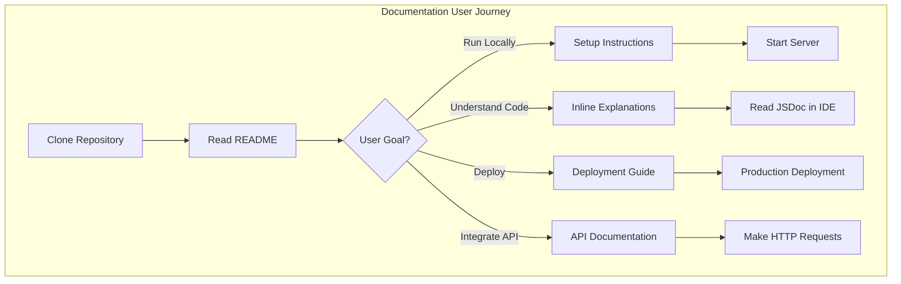
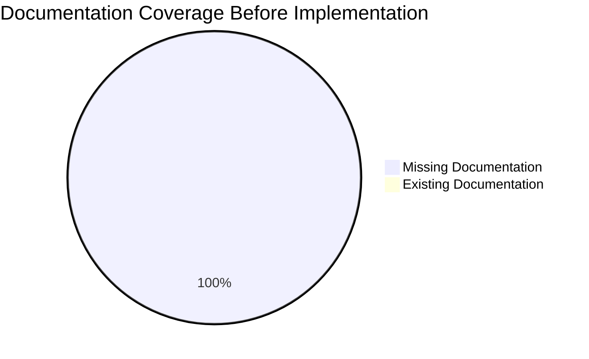
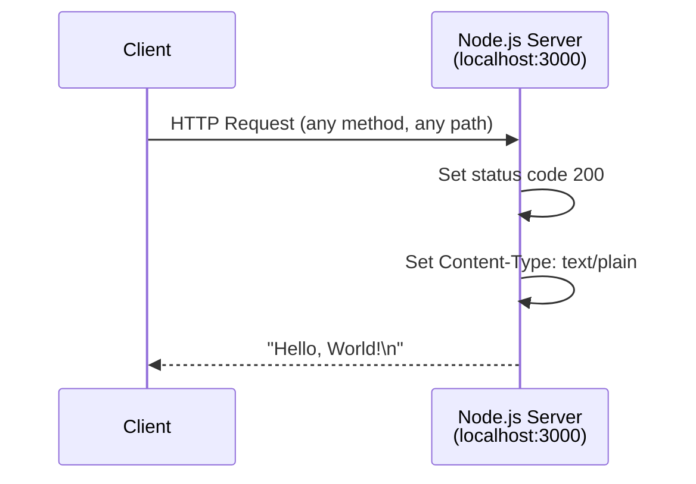
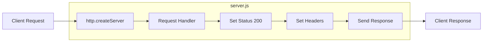
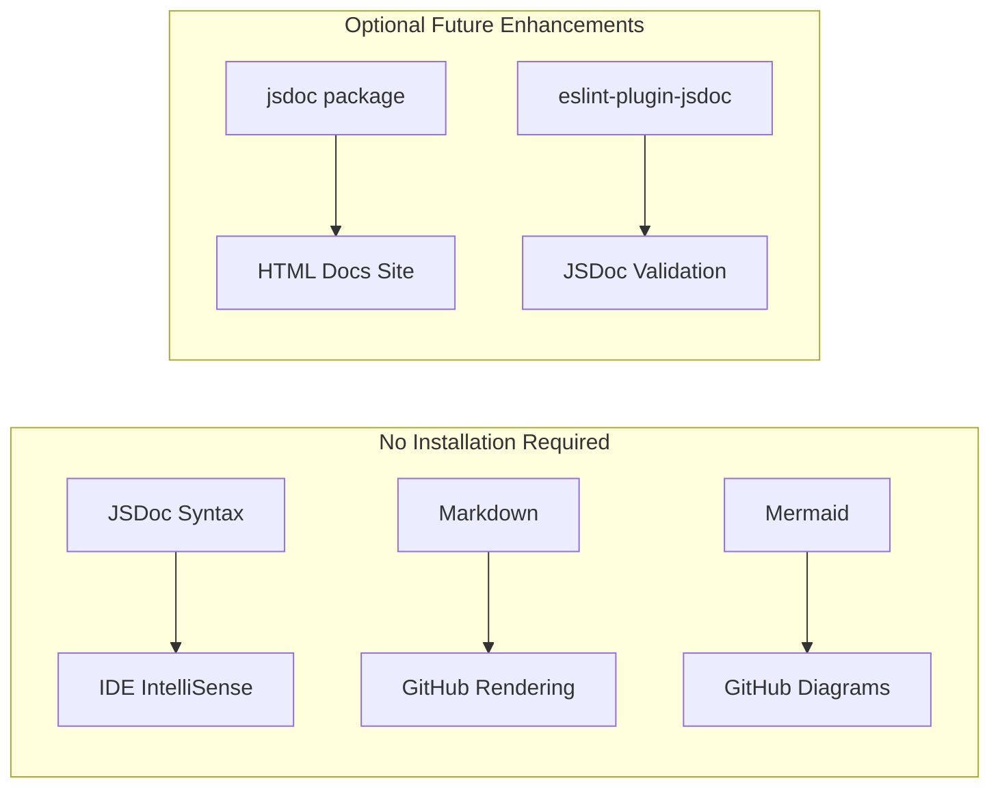
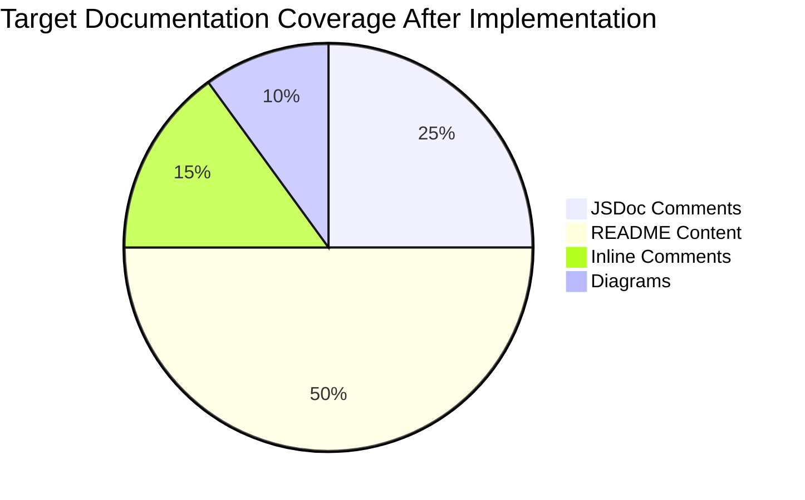
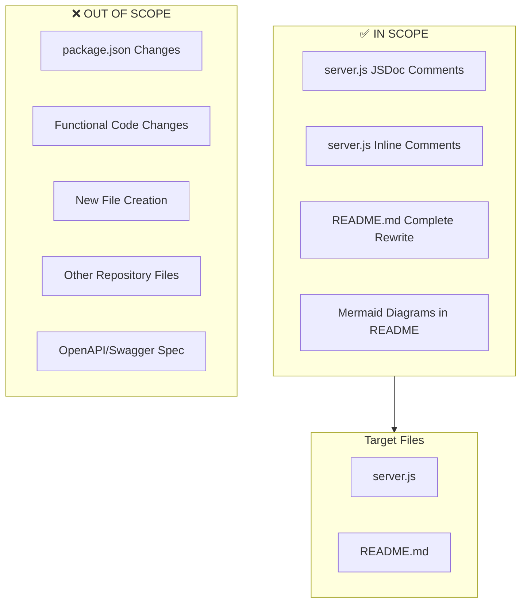

# Technical Specification

# 0. Agent Action Plan

## 0.1 Intent Clarification

### 0.1.1 Core Documentation Objective

Based on the provided requirements, the Blitzy platform understands that the documentation objective is to **enhance the code documentation and project comprehensibility** of the `hao-backprop-test` Node.js HTTP server project through comprehensive inline code comments and an expanded README file.

| Attribute | Value |
|-----------|-------|
| Request Category | Create new documentation + Update existing documentation |
| Documentation Type | API docs, README file, Setup instructions, Deployment guide, Inline code explanations |
| Primary Target File | `server.js` |
| Secondary Target File | `README.md` |

**Detailed Requirements Breakdown:**

- **JSDoc Comments for server.js**: Add structured documentation comments to all functions, variables, and the request handler callback in `server.js` using the JSDoc standard (`/** ... */` format)
- **Comprehensive README**: Transform the minimal 2-line README into a complete project documentation hub containing:
  - Setup instructions (prerequisites, installation, running the server)
  - API documentation (endpoint specification, request/response format)
  - Deployment guide (production considerations, environment configuration)
  - Inline code explanations (architectural overview, code flow description)

**Implicit Documentation Needs Identified:**

- Configuration documentation (hostname, port, and customization options)
- Prerequisites section (Node.js version requirements)
- Troubleshooting section (common issues and solutions)
- License and author attribution (currently in package.json but not documented in README)
- Project purpose explanation (Backprop integration testing context)

### 0.1.2 Special Instructions and Constraints

**Critical Directives:**

- The project contains a warning in the existing README: "Do not touch!" - This should be interpreted as historical guidance that will be replaced with comprehensive documentation
- Maintain the repository's purpose as a Backprop integration test scaffold
- Keep documentation simple and appropriate for a minimal "Hello World" server
- Follow Node.js and JavaScript community documentation conventions

**Style Preferences:**

- Use standard JSDoc syntax compatible with IDE IntelliSense (VS Code, JetBrains)
- Markdown formatting for README with proper headers and code blocks
- Include code examples that users can copy-paste directly
- Keep language accessible to developers of all experience levels

**Web Search Research Conducted:**

<cite index="1-4">"JSDoc emerges as a cornerstone tool for developers aiming to achieve this, providing a structured approach to documenting code which, in turn, enhances maintainability, scalability, and understanding across teams."</cite>

<cite index="8-1,8-2">"JSDoc comments should generally be placed immediately before the code being documented. Each comment must start with a /** sequence in order to be recognized by the JSDoc parser."</cite>

<cite index="18-10,18-11">"The first thing my README has to answer for everyone is 'what is this?' The most important information everyone should see right away is module's name and description."</cite>

### 0.1.3 Technical Interpretation

These documentation requirements translate to the following technical documentation strategy:

| Requirement | Technical Action | Target Files |
|-------------|-----------------|--------------|
| Add JSDoc comments to server.js functions | Add `@description`, `@param`, `@returns`, `@example` tags to all code elements | `server.js` |
| Create comprehensive README | Complete rewrite with structured sections | `README.md` |
| Setup instructions | Document Node.js prerequisites, npm commands, and startup procedure | `README.md` |
| API documentation | Document the single HTTP endpoint with request/response specification | `README.md` |
| Deployment guide | Document production deployment considerations | `README.md` |
| Inline code explanations | Add explanatory comments within code and architectural narrative in README | `server.js`, `README.md` |

**Implementation Mapping:**

- To document the HTTP server creation, we will add JSDoc comments to the `server` constant and the request handler callback function
- To document configuration variables, we will add JSDoc comments to `hostname` and `port` constants with `@const` and `@type` tags
- To create setup instructions, we will document the prerequisites (Node.js LTS) and provide step-by-step installation commands
- To create API documentation, we will document the single endpoint (`GET /`) with request headers, response format, and status codes
- To create deployment guide, we will document environment considerations, binding to external interfaces, and process management

### 0.1.4 Inferred Documentation Needs

**Based on Code Analysis:**

- `server.js` contains no existing documentation comments - all code elements require JSDoc annotation
- The request handler callback at line 6-10 needs documentation for `req` and `res` parameters
- Configuration constants (`hostname`, `port`) require type annotations and purpose descriptions
- The `server.listen()` callback requires documentation explaining startup confirmation

**Based on Repository Structure:**

- Single-file architecture simplifies documentation scope
- No external dependencies means minimal prerequisite documentation
- Zero-configuration design reduces deployment documentation complexity

**Based on User Journey:**

- New users need clear "Getting Started" path from clone to running server
- Developers need API reference showing request/response contract
- Operations staff need deployment guidance for production environments
- Contributors need understanding of code architecture and design decisions




## 0.2 Documentation Discovery and Analysis

### 0.2.1 Existing Documentation Infrastructure Assessment

**Repository Analysis Results:**

The repository analysis reveals a **minimal documentation structure** with **critical coverage gaps**. The project currently lacks any formal documentation framework, inline code comments, or comprehensive README content.

| Documentation Artifact | Status | Location | Assessment |
|------------------------|--------|----------|------------|
| README.md | Exists (minimal) | `/README.md` | 2 lines only; lacks setup, API, deployment info |
| JSDoc Comments | Missing | `server.js` | No documentation comments present |
| Documentation Generator | Not configured | N/A | No mkdocs, docusaurus, jsdoc.json found |
| API Specification | Missing | N/A | No OpenAPI/Swagger specification |
| Code Comments | Missing | `server.js` | No inline explanatory comments |

**Search Patterns Employed:**

```
Documentation files searched:
- README*.md → Found: README.md (minimal content)
- docs/**     → Not found (no docs folder)
- *.md        → Found: README.md only
- *.rst       → Not found
- wiki/**     → Not found

Documentation generator configs searched:
- mkdocs.yml           → Not found
- docusaurus.config.js → Not found
- sphinx/conf.py       → Not found
- jsdoc.json           → Not found
- .jsdocrc             → Not found
```

**Existing README Content:**

```
# hao-backprop-test
test project for backprop integration. Do not touch!
```

| README Element | Present | Notes |
|----------------|---------|-------|
| Project Title | ✅ Yes | "hao-backprop-test" |
| Description | ✅ Partial | One sentence only |
| Installation | ❌ No | Missing entirely |
| Usage | ❌ No | Missing entirely |
| API Documentation | ❌ No | Missing entirely |
| Deployment Guide | ❌ No | Missing entirely |
| License | ❌ No | MIT license in package.json but not in README |
| Author | ❌ No | hxu in package.json but not in README |

### 0.2.2 Repository Code Analysis for Documentation

**Source Code Files Requiring Documentation:**

| File | Lines | Functions/Elements | Current Doc Status |
|------|-------|-------------------|-------------------|
| `server.js` | 14 | 3 constants + 1 callback + 1 listener | No JSDoc comments |

**Detailed Code Element Analysis (`server.js`):**

| Line | Element | Type | Documentation Needed |
|------|---------|------|---------------------|
| 1 | `require('http')` | Module import | JSDoc `@module` tag |
| 3 | `hostname` | Constant | `@const`, `@type {string}`, description |
| 4 | `port` | Constant | `@const`, `@type {number}`, description |
| 6-10 | Request handler | Arrow function | `@param {http.IncomingMessage}`, `@param {http.ServerResponse}`, `@description` |
| 12-14 | `server.listen()` | Method call + callback | Inline explanation comment |

**Current `server.js` Content (no documentation):**

```javascript
const http = require('http');

const hostname = '127.0.0.1';
const port = 3000;

const server = http.createServer((req, res) => {
  res.statusCode = 200;
  res.setHeader('Content-Type', 'text/plain');
  res.end('Hello, World!\n');
});

server.listen(port, hostname, () => {
  console.log(`Server running at http://${hostname}:${port}/`);
});
```

**Key Directories Examined:**

| Directory | Contents | Documentation Relevance |
|-----------|----------|------------------------|
| `/` (root) | server.js, package.json, README.md, data files | Primary documentation targets |
| `.git/` | Git repository data | Not relevant to documentation |

**Related Documentation Found:**

- `package.json` contains metadata that should be reflected in README (name, version, description, author, license)
- `industry.csv` is a static data file that could be documented if relevant to API usage

### 0.2.3 Documentation Framework Status

**Current Documentation Framework:** None configured

| Component | Status | Recommendation |
|-----------|--------|----------------|
| Documentation generator | Not present | Add JSDoc for API documentation generation (optional) |
| Configuration file | Not present | Consider `jsdoc.json` for future expansion |
| API documentation tools | Not present | JSDoc comments provide IDE integration without additional tools |
| Diagram tools | Not present | Mermaid diagrams can be embedded directly in README.md |
| Documentation hosting | Not present | GitHub renders README.md automatically |

### 0.2.4 Web Search Research Conducted

**Best Practices Research Results:**

| Topic | Key Finding | Source |
|-------|-------------|--------|
| JSDoc Comments | <cite index="3-1,3-2">"JSDoc comments start with `/**` and end with `*/`. Within these comments, you can use various tags to describe different aspects of your code."</cite> | Medium JSDoc Guide |
| README Structure | <cite index="18-18">"The README should answer quickly the following questions"</cite> - what is this, how to install, how to use | How I Organize README |
| Node.js Documentation | Document as you code to keep documentation up-to-date with codebase | HackerOne JSDoc Best Practices |
| Project Structure | <cite index="12-23">"README.md describes your project"</cite> as part of well-organized Node.js project structure | Dev.to Node.js Best Practices |

**Documentation Best Practices Applied:**

- Use JSDoc for inline API documentation that integrates with IDEs
- Structure README with clear sections: overview, installation, usage, API reference, deployment
- Include working code examples that can be copy-pasted
- Provide troubleshooting guidance for common issues
- Add visual diagrams for complex workflows (using Mermaid)


## 0.3 Documentation Scope Analysis

### 0.3.1 Code-to-Documentation Mapping

**Module: `server.js` (HTTP Server)**

| Code Element | Location | Current Documentation | Documentation Needed |
|--------------|----------|----------------------|---------------------|
| Module declaration | Line 1 | Missing | `@fileoverview` or `@module` with file description |
| `http` import | Line 1 | Missing | Inline comment explaining built-in module usage |
| `hostname` constant | Line 3 | Missing | `@const`, `@type {string}`, `@default '127.0.0.1'` |
| `port` constant | Line 4 | Missing | `@const`, `@type {number}`, `@default 3000` |
| `server` constant | Line 6 | Missing | `@const`, `@type {http.Server}`, server description |
| Request handler callback | Lines 6-10 | Missing | `@callback`, `@param {http.IncomingMessage} req`, `@param {http.ServerResponse} res` |
| Response status code | Line 7 | Missing | Inline comment explaining 200 OK |
| Content-Type header | Line 8 | Missing | Inline comment explaining plain text response |
| Response body | Line 9 | Missing | Inline comment explaining response content |
| `server.listen()` | Line 12 | Missing | Inline comment explaining binding and callback |
| Startup callback | Lines 12-14 | Missing | Inline comment explaining console output purpose |

**Public APIs Requiring Documentation:**

| API Element | Type | Parameters | Return Value | Documentation Priority |
|-------------|------|------------|--------------|----------------------|
| HTTP GET / | Endpoint | None required | "Hello, World!\n" (text/plain) | High |
| Request Handler | Callback | `req`, `res` | void (writes to response) | High |

**Configuration Options Requiring Documentation:**

| Config Option | Current Value | Type | Customizable | Documentation Location |
|---------------|---------------|------|--------------|----------------------|
| `hostname` | '127.0.0.1' | string | Via code edit | JSDoc + README |
| `port` | 3000 | number | Via code edit | JSDoc + README |

### 0.3.2 Documentation Gap Analysis

Given the requirements and repository analysis, documentation gaps include:

**Critical Gaps (Must Address):**

| Gap Category | Current State | Required State | Priority |
|--------------|---------------|----------------|----------|
| JSDoc Comments | 0% coverage | 100% coverage of all code elements | P0 |
| README Setup Instructions | Missing | Complete installation and startup guide | P0 |
| README API Documentation | Missing | Full endpoint specification with examples | P0 |
| README Deployment Guide | Missing | Production deployment considerations | P0 |

**Undocumented Public APIs:**

| Endpoint | Method | Path | Response Format | Documentation Status |
|----------|--------|------|-----------------|---------------------|
| Root | GET | `/` | text/plain | ❌ Not documented |
| Root | POST | `/` | text/plain (same response) | ❌ Not documented |
| Root | PUT | `/` | text/plain (same response) | ❌ Not documented |
| Root | DELETE | `/` | text/plain (same response) | ❌ Not documented |
| Any | ANY | `/*` | text/plain (same response) | ❌ Not documented |

*Note: Server responds identically to all HTTP methods and paths - this behavior should be documented.*

**Missing User Guides:**

| Guide Type | Status | Content Needed |
|------------|--------|----------------|
| Quick Start | Missing | Clone, install, run in 3 steps |
| Development Setup | Missing | Prerequisites, environment setup |
| Testing Guide | Missing | How to test the server response |
| Deployment Guide | Missing | Production deployment steps |

**Incomplete Architecture Documentation:**

| Area | Status | Content Needed |
|------|--------|----------------|
| System Overview | Partial (in tech spec) | High-level diagram in README |
| Data Flow | Missing | Request-response flow explanation |
| Configuration | Missing | Environment and port configuration |

### 0.3.3 Features Requiring Documentation

**Feature: HTTP Server**

| Aspect | Current Coverage | Gap Analysis |
|--------|------------------|--------------|
| Basic functionality | Not documented | Need: What does the server do? |
| Request handling | Not documented | Need: How are requests processed? |
| Response format | Not documented | Need: What response is returned? |
| Error handling | Not documented | Need: How are errors handled? (N/A - no error handling) |

**Feature: Server Configuration**

| Configuration | Current Coverage | Gap Analysis |
|---------------|------------------|--------------|
| Hostname binding | Not documented | Need: Why localhost? How to change? |
| Port selection | Not documented | Need: Why 3000? How to change? |
| Protocol | Not documented | Need: HTTP only, no HTTPS |

### 0.3.4 Documentation Coverage Summary



**Target Documentation Coverage:**

| Category | Current | Target | Files Affected |
|----------|---------|--------|----------------|
| JSDoc Comments | 0% | 100% | server.js |
| README Sections | 10% | 100% | README.md |
| Setup Instructions | 0% | 100% | README.md |
| API Documentation | 0% | 100% | README.md |
| Deployment Guide | 0% | 100% | README.md |
| Code Explanations | 0% | 100% | server.js, README.md |

**Total Documentation Items to Create:**

| Item Type | Count | Description |
|-----------|-------|-------------|
| JSDoc file header | 1 | File-level documentation block |
| JSDoc constant tags | 3 | For `hostname`, `port`, `server` |
| JSDoc callback documentation | 1 | Request handler callback |
| Inline code comments | 5+ | Explanatory comments within code |
| README sections | 8+ | Overview, Install, Usage, API, Deploy, etc. |


## 0.4 Documentation Implementation Design

### 0.4.1 Documentation Structure Planning

**Target Documentation Hierarchy:**

```
/
├── README.md (comprehensive project documentation)
│   ├── Project Overview
│   ├── Table of Contents
│   ├── Features
│   ├── Prerequisites
│   ├── Installation
│   ├── Usage
│   ├── API Reference
│   ├── Deployment Guide
│   ├── Configuration
│   ├── Troubleshooting
│   ├── License
│   └── Author
│
└── server.js (fully documented with JSDoc + inline comments)
    ├── File header JSDoc block
    ├── Configuration constants (JSDoc)
    ├── Server creation (JSDoc)
    ├── Request handler (JSDoc)
    └── Inline explanatory comments
```

**README.md Section Structure:**

| Section | Heading Level | Content Description |
|---------|---------------|---------------------|
| Title & Badges | H1 | Project name with npm/Node.js badges |
| Description | Paragraph | Purpose and use case explanation |
| Table of Contents | List | Navigation links to all sections |
| Features | H2 | Key features as bullet list |
| Prerequisites | H2 | Node.js version requirements |
| Installation | H2 | Clone and setup commands |
| Usage | H2 | How to start and use the server |
| API Reference | H2 | Endpoint specification |
| Deployment Guide | H2 | Production deployment instructions |
| Configuration | H2 | Hostname and port customization |
| Troubleshooting | H2 | Common issues and solutions |
| Code Explanation | H2 | Architectural overview |
| License | H2 | MIT license statement |
| Author | H2 | Attribution to hxu |

### 0.4.2 Content Generation Strategy

**Information Extraction Approach:**

| Information Source | Extraction Method | Target Documentation |
|--------------------|-------------------|---------------------|
| `server.js` code | Parse function signatures, constants | JSDoc comments |
| `package.json` metadata | Extract name, version, author, license | README badges and metadata |
| Tech spec sections | Reference existing documentation | README content |
| Node.js built-in `http` module | Document standard API usage | JSDoc parameter types |

**JSDoc Comment Strategy:**

For each code element in `server.js`:

```javascript
// Pattern for file header
/**
 * @fileoverview [Description of file purpose]
 * @module [module-name]
 * @version [version]
 * @author [author]
 * @license [license]
 */

// Pattern for constants
/**
 * @const {type} [name] - [description]
 * @default [value]
 */

// Pattern for callback functions
/**
 * @callback RequestHandler
 * @param {http.IncomingMessage} req - [description]
 * @param {http.ServerResponse} res - [description]
 */
```

**README Content Strategy:**

| Section | Content Source | Writing Approach |
|---------|----------------|------------------|
| Overview | Tech spec 1.1.1 | Concise summary of purpose |
| Installation | Standard Node.js setup | Step-by-step commands |
| Usage | Code analysis | Example commands with output |
| API Reference | Code analysis | Table format with cURL examples |
| Deployment | Best practices research | Production checklist |
| Configuration | Code constants | Table with defaults and options |

### 0.4.3 Documentation Standards

**Markdown Formatting Standards:**

| Element | Format | Example |
|---------|--------|---------|
| Main title | `# Title` | `# hello_world` |
| Section headers | `## Section` | `## Installation` |
| Subsection headers | `### Subsection` | `### Using npm` |
| Code blocks | ` ```language ``` ` | ` ```bash npm install ``` ` |
| Inline code | `` `code` `` | `` `server.js` `` |
| Tables | Markdown tables | `\| Header \| Value \|` |
| Lists | `- item` or `1. item` | `- Feature one` |
| Links | `[text](url)` | `[Node.js](https://nodejs.org)` |

**JSDoc Tag Standards:**

| Tag | Usage | Example |
|-----|-------|---------|
| `@fileoverview` | File description | `@fileoverview Minimal HTTP server for testing` |
| `@module` | Module name | `@module hello_world` |
| `@const` | Constant declaration | `@const {string}` |
| `@type` | Type annotation | `@type {number}` |
| `@default` | Default value | `@default 3000` |
| `@param` | Function parameter | `@param {http.IncomingMessage} req` |
| `@returns` | Return value | `@returns {void}` |
| `@example` | Usage example | `@example node server.js` |
| `@see` | Related reference | `@see {@link https://nodejs.org}` |
| `@author` | Author attribution | `@author hxu` |
| `@license` | License type | `@license MIT` |
| `@version` | Version number | `@version 1.0.0` |

**Source Citation Format:**

All technical details in documentation will include source file references:

```
Source: /server.js:Line
```

### 0.4.4 Diagram and Visual Strategy

**Mermaid Diagrams to Create:**

| Diagram Type | Purpose | Location |
|--------------|---------|----------|
| Request Flow | Show HTTP request-response cycle | README.md |
| Architecture | High-level server architecture | README.md |

**Request-Response Flow Diagram:**



**Server Architecture Diagram:**



### 0.4.5 Code Example Standards

**Example Format for README:**

All code examples will follow this pattern:

```
### Example Title

**Command:**
` ` `bash
command here
` ` `

**Expected Output:**
` ` `
output here
` ` `
```

**Specific Examples to Include:**

| Example | Command | Expected Output |
|---------|---------|-----------------|
| Start server | `node server.js` | `Server running at http://127.0.0.1:3000/` |
| Test with cURL | `curl http://127.0.0.1:3000/` | `Hello, World!` |
| Test with browser | Open `http://127.0.0.1:3000` | Display "Hello, World!" |


## 0.5 Documentation File Transformation Mapping

### 0.5.1 File-by-File Documentation Plan

**Documentation Transformation Modes:**
- **CREATE** - Create a new documentation file
- **UPDATE** - Update an existing documentation file  
- **DELETE** - Remove an obsolete documentation file
- **REFERENCE** - Use as an example for documentation style and structure

| Target Documentation File | Transformation | Source Code/Docs | Content/Changes |
|---------------------------|----------------|------------------|-----------------|
| `server.js` | UPDATE | `server.js` | Add JSDoc file header, constant documentation, request handler documentation, inline explanatory comments |
| `README.md` | UPDATE | `README.md`, `package.json`, `server.js` | Complete rewrite with setup instructions, API documentation, deployment guide, code explanations, troubleshooting |

### 0.5.2 New Documentation Content Detail

**No new files will be created** - all documentation will be added to existing files (`server.js` and `README.md`).

### 0.5.3 Documentation Files to Update Detail

#### File: `server.js` - Add JSDoc Comments and Inline Explanations

**Current State:** 14 lines, no comments

**Target State:** ~50+ lines with comprehensive JSDoc and inline comments

| Section | Line Range | JSDoc Tags | Content |
|---------|------------|------------|---------|
| File Header | Lines 1-12 | `@fileoverview`, `@module`, `@version`, `@author`, `@license`, `@see`, `@example` | Module description, metadata, usage example |
| HTTP Import | Line 13+ | Inline comment | Explain Node.js built-in http module |
| hostname constant | After import | `@const`, `@type`, `@default` | Server hostname configuration |
| port constant | After hostname | `@const`, `@type`, `@default` | Server port configuration |
| server constant | After port | `@const`, `@type` | HTTP server instance |
| Request Handler | Callback | `@description`, `@param` (x2) | Request handling logic explanation |
| Response Lines | Inside handler | Inline comments | Explain status, header, and body |
| server.listen | After handler | Inline comment | Explain server startup and binding |

**JSDoc Structure for server.js:**

```
/**
 * @fileoverview Minimal HTTP server for Backprop integration testing
 * @module hello_world
 * @version 1.0.0
 * @author hxu
 * @license MIT
 * @see {@link https://nodejs.org/api/http.html} Node.js HTTP Module
 * @example
 * // Start the server
 * node server.js
 * // Test with cURL
 * curl http://127.0.0.1:3000/
 */

// Import Node.js built-in HTTP module
const http = require('http');

/**
 * Server hostname - localhost binding for development
 * @const {string}
 * @default '127.0.0.1'
 */
const hostname = '127.0.0.1';

/**
 * Server port number
 * @const {number}  
 * @default 3000
 */
const port = 3000;

/**
 * HTTP Server instance
 * @const {http.Server}
 */
const server = http.createServer((req, res) => {
  // ... inline comments
});
```

#### File: `README.md` - Complete Rewrite

**Current State:** 2 lines (title + warning)

**Target State:** Comprehensive README (~150+ lines)

| Section | Heading | Content Description |
|---------|---------|---------------------|
| Title | `# hello_world` | Project name with badges |
| Description | (paragraph) | Purpose: Backprop integration testing scaffold |
| Table of Contents | (list) | Links to all sections |
| Features | `## Features` | Key capabilities bullet list |
| Prerequisites | `## Prerequisites` | Node.js version requirements |
| Installation | `## Installation` | Clone and setup steps |
| Usage | `## Usage` | Start server and test commands |
| API Reference | `## API Reference` | Endpoint specification table |
| Deployment | `## Deployment Guide` | Production deployment steps |
| Configuration | `## Configuration` | Hostname/port customization |
| Code Explanation | `## Code Explanation` | Architecture overview with diagrams |
| Troubleshooting | `## Troubleshooting` | Common issues and solutions |
| License | `## License` | MIT license statement |
| Author | `## Author` | Attribution to hxu |

**README Section Details:**

| Section | Estimated Lines | Key Content Elements |
|---------|-----------------|---------------------|
| Header + Badges | 5 | Title, version badge, Node.js badge |
| Description | 10 | Purpose, use case, project context |
| Table of Contents | 15 | Links to all sections |
| Features | 10 | 5-6 feature bullet points |
| Prerequisites | 8 | Node.js version, npm |
| Installation | 15 | Step-by-step commands |
| Usage | 20 | Examples with expected output |
| API Reference | 25 | Endpoint table, request/response examples |
| Deployment | 20 | Production considerations |
| Configuration | 15 | Configuration options table |
| Code Explanation | 30 | Architecture diagram, code walkthrough |
| Troubleshooting | 15 | Common issues table |
| License | 3 | MIT statement |
| Author | 3 | Attribution |

### 0.5.4 Documentation Configuration Updates

**No documentation configuration files exist or need to be created** for this minimal project.

| Potential Config File | Status | Action |
|----------------------|--------|--------|
| `jsdoc.json` | Not present | Not required - JSDoc comments work without config |
| `mkdocs.yml` | Not present | Not required - README.md serves documentation needs |
| `.readthedocs.yml` | Not present | Not required - GitHub renders README automatically |

### 0.5.5 Cross-Documentation Dependencies

**Shared Content Between Files:**

| Content | Source | Used In |
|---------|--------|---------|
| Project name | `package.json` | `README.md`, `server.js` JSDoc |
| Version | `package.json` | `README.md`, `server.js` JSDoc |
| Author | `package.json` | `README.md`, `server.js` JSDoc |
| License | `package.json` | `README.md`, `server.js` JSDoc |
| Hostname | `server.js` | `README.md` Configuration section |
| Port | `server.js` | `README.md` Configuration section |

**Navigation Links Within README:**

| Link Text | Target Section |
|-----------|----------------|
| Features | `#features` |
| Prerequisites | `#prerequisites` |
| Installation | `#installation` |
| Usage | `#usage` |
| API Reference | `#api-reference` |
| Deployment | `#deployment-guide` |
| Configuration | `#configuration` |
| Code Explanation | `#code-explanation` |
| Troubleshooting | `#troubleshooting` |
| License | `#license` |
| Author | `#author` |

### 0.5.6 Complete File List Summary

**Files Modified (Total: 2):**

| File Path | Transformation | Primary Changes |
|-----------|----------------|-----------------|
| `/server.js` | UPDATE | Add JSDoc file header, document all constants, document request handler callback, add inline explanatory comments throughout code |
| `/README.md` | UPDATE | Complete rewrite with: project overview, installation guide, usage examples, API reference, deployment guide, configuration guide, code explanation, troubleshooting, license, author attribution |

**Files Not Modified:**

| File Path | Reason |
|-----------|--------|
| `package.json` | No documentation changes required (metadata already accurate) |
| `package-lock.json` | Lockfile, not relevant to documentation |
| `industry.csv` | Static data file, not relevant to documentation scope |
| `LoginTest.java` | Java placeholder, not relevant to this documentation task |
| `test.py.txt` | Empty placeholder, not relevant |
| `test.txt.txt` | Empty placeholder, not relevant |


## 0.6 Dependency Inventory

### 0.6.1 Documentation Dependencies

**Current Project Dependencies:**

The `hao-backprop-test` project has **zero external dependencies**. All functionality relies on Node.js built-in modules.

| Registry | Package Name | Version | Purpose |
|----------|--------------|---------|---------|
| Built-in | `http` | Node.js built-in | HTTP server creation |

**Documentation Tools Analysis:**

For this documentation task, no additional packages are strictly required. The documentation approach relies on:

| Tool | Type | Status | Purpose |
|------|------|--------|---------|
| JSDoc Comments | Syntax standard | No installation needed | Inline code documentation (IDE integration) |
| Markdown | Syntax standard | No installation needed | README.md formatting |
| Mermaid | Diagram syntax | No installation needed | Diagrams in README (GitHub-rendered) |

### 0.6.2 Optional Documentation Tool Recommendations

If the project wishes to generate HTML documentation from JSDoc comments in the future, the following tools could be added as **optional dev dependencies**:

| Registry | Package Name | Recommended Version | Purpose |
|----------|--------------|---------------------|---------|
| npm | jsdoc | 4.0.4 | Generate HTML API documentation from JSDoc comments |
| npm | docdash | 2.0.2 | Improved JSDoc template with better styling |
| npm | eslint-plugin-jsdoc | 50.5.0 | ESLint rules for validating JSDoc comments |

**Note:** These tools are **NOT required** for the current documentation task. JSDoc comments in `server.js` will provide IDE IntelliSense without any additional packages.

### 0.6.3 Runtime Requirements for Documentation

**Node.js Runtime:**

| Attribute | Requirement | Source |
|-----------|-------------|--------|
| Node.js Version | Any LTS version (20.x, 22.x, or 24.x recommended) | `package.json` (no explicit requirement) |
| npm Version | 7.x or later | Required for `lockfileVersion: 3` in package-lock.json |

**Verification Commands:**

```bash
# Check Node.js version
node --version

#### Check npm version
npm --version
```

### 0.6.4 Documentation Reference Updates

**Internal Link Structure:**

The README.md will use standard Markdown anchor links for internal navigation:

| Section | Anchor Link |
|---------|-------------|
| Features | `#features` |
| Prerequisites | `#prerequisites` |
| Installation | `#installation` |
| Usage | `#usage` |
| API Reference | `#api-reference` |
| Deployment Guide | `#deployment-guide` |
| Configuration | `#configuration` |
| Code Explanation | `#code-explanation` |
| Troubleshooting | `#troubleshooting` |
| License | `#license` |
| Author | `#author` |

**External Reference Links to Include:**

| Reference | URL | Usage Location |
|-----------|-----|----------------|
| Node.js Documentation | `https://nodejs.org/` | README Prerequisites |
| Node.js HTTP Module | `https://nodejs.org/api/http.html` | JSDoc `@see` tag, README Code Explanation |
| npm Registry | `https://www.npmjs.com/` | README Prerequisites |

### 0.6.5 package.json Documentation Metadata

**Current `package.json` Values Used in Documentation:**

| Field | Current Value | Documentation Usage |
|-------|---------------|---------------------|
| `name` | `hello_world` | README title, JSDoc `@module` |
| `version` | `1.0.0` | README badge, JSDoc `@version` |
| `description` | `Hello world in Node.js` | README overview |
| `main` | `index.js` | Note: Mismatch with `server.js` (potential documentation note) |
| `author` | `hxu` | README Author section, JSDoc `@author` |
| `license` | `MIT` | README License section, JSDoc `@license` |

**Note on `main` Field Mismatch:**

The `package.json` specifies `main: "index.js"` but the actual server file is `server.js`. This discrepancy will be noted in the README troubleshooting section as a known issue that does not affect direct execution via `node server.js`.

### 0.6.6 Dependency-Free Documentation Approach

**Benefits of Zero-Dependency Documentation:**

| Benefit | Description |
|---------|-------------|
| Immediate IDE Support | JSDoc comments work in VS Code, WebStorm, etc. without any setup |
| GitHub Rendering | README.md with Mermaid diagrams renders automatically on GitHub |
| No Build Step | Documentation is visible directly in source files |
| Minimal Maintenance | No documentation tool version updates required |
| Universal Compatibility | Works with any Node.js version |

**Documentation Toolchain Summary:**




## 0.7 Coverage and Quality Targets

### 0.7.1 Documentation Coverage Metrics

**Current Coverage Analysis:**

| Documentation Category | Current Count | Total Items | Coverage % |
|------------------------|---------------|-------------|------------|
| Public APIs documented | 0 | 1 | 0% |
| Code elements with JSDoc | 0 | 5 | 0% |
| README sections complete | 1 | 12 | 8% |
| Inline code comments | 0 | 8 | 0% |
| Configuration options documented | 0 | 2 | 0% |

**Target Coverage: 100%** based on user requirement for comprehensive documentation.

**Coverage Gap Details:**

| Component | Current % | Target % | Gap |
|-----------|-----------|----------|-----|
| `server.js` JSDoc comments | 0% | 100% | All code elements need documentation |
| `server.js` inline comments | 0% | 100% | All logic sections need explanation |
| `README.md` content | 8% | 100% | 11 sections need creation |
| API endpoint documentation | 0% | 100% | HTTP endpoint needs full spec |

### 0.7.2 Documentation Quality Criteria

**Completeness Requirements:**

| Requirement | Validation Criteria |
|-------------|---------------------|
| All public APIs have descriptions | HTTP endpoint documented with method, path, headers, response |
| All code elements have JSDoc | Every `const`, callback, and module has JSDoc block |
| All user guides include setup, usage | README has Installation, Usage sections with commands |
| All architecture docs include diagrams | README has request-response flow diagram |
| All code examples are working | Commands can be copy-pasted and executed successfully |

**Accuracy Validation Criteria:**

| Criterion | Validation Method |
|-----------|-------------------|
| Code examples must be tested | Verify `node server.js` and `curl` commands work |
| API signatures must match codebase | JSDoc types match actual function signatures |
| Configuration values are accurate | Default hostname/port match `server.js` constants |
| Version numbers are correct | Match `package.json` version field |

**Clarity Standards:**

| Standard | Implementation |
|----------|----------------|
| Technical accuracy | Use correct terminology (HTTP, request, response, etc.) |
| Accessible language | Explain concepts for all skill levels |
| Progressive disclosure | Simple overview first, detailed API reference later |
| Consistent terminology | Use same terms throughout (server, endpoint, request handler) |

**Maintainability Standards:**

| Standard | Implementation |
|----------|----------------|
| Source citations | Reference source file and line numbers where applicable |
| Clear structure | Logical section ordering in README |
| Modular documentation | JSDoc inline with code for automatic sync |
| Version tracking | Include `@version` tag in JSDoc |

### 0.7.3 Example and Diagram Requirements

**Minimum Examples Per Section:**

| Section | Minimum Examples | Type |
|---------|------------------|------|
| Installation | 2 | Shell commands |
| Usage | 3 | Shell commands with output |
| API Reference | 2 | cURL requests with responses |
| Configuration | 2 | Code modification examples |
| Troubleshooting | 3 | Problem/solution pairs |

**Diagram Requirements:**

| Diagram Type | Required | Purpose |
|--------------|----------|---------|
| Request-Response Flow | Yes | Show HTTP request handling |
| Architecture Overview | Optional | Show server components |

**Code Example Testing:**

| Example | Test Command | Expected Result |
|---------|--------------|-----------------|
| Server start | `node server.js` | Console output: "Server running at..." |
| cURL test | `curl http://127.0.0.1:3000/` | Output: "Hello, World!" |
| POST test | `curl -X POST http://127.0.0.1:3000/` | Output: "Hello, World!" |

### 0.7.4 Quality Checklist

**JSDoc Quality Checklist:**

| Item | Requirement |
|------|-------------|
| ☐ | Every exported/public element has JSDoc block |
| ☐ | `@fileoverview` present at file top |
| ☐ | `@param` tags for all function parameters |
| ☐ | `@returns` or `@type` for return values/types |
| ☐ | `@const` and `@type` for constants |
| ☐ | `@example` with working code |
| ☐ | `@author`, `@version`, `@license` metadata |
| ☐ | `@see` for related documentation links |

**README Quality Checklist:**

| Item | Requirement |
|------|-------------|
| ☐ | Clear project title and description |
| ☐ | Table of contents for navigation |
| ☐ | Prerequisites clearly stated |
| ☐ | Installation steps are numbered and clear |
| ☐ | Usage examples include expected output |
| ☐ | API reference has complete specification |
| ☐ | Deployment guide covers production considerations |
| ☐ | Configuration options documented with defaults |
| ☐ | Troubleshooting section addresses common issues |
| ☐ | License and author information present |
| ☐ | All code blocks have language identifiers |
| ☐ | Diagrams render correctly in GitHub |

### 0.7.5 Post-Implementation Coverage Target



**Final Coverage Targets:**

| Metric | Target |
|--------|--------|
| JSDoc coverage | 100% of code elements |
| README completeness | 100% of required sections |
| Working examples | 100% verified functional |
| API documentation | 100% of endpoints |
| Configuration docs | 100% of options |


## 0.8 Scope Boundaries

### 0.8.1 Exhaustively In Scope

**Documentation Files to Modify:**

| File Pattern | Description | Transformation |
|--------------|-------------|----------------|
| `/server.js` | Main HTTP server file | UPDATE - Add JSDoc comments and inline explanations |
| `/README.md` | Project documentation | UPDATE - Complete rewrite with comprehensive documentation |

**In-Scope Documentation Types:**

| Documentation Type | Target File | In Scope |
|--------------------|-------------|----------|
| JSDoc file header | `server.js` | ✅ Yes |
| JSDoc constant documentation | `server.js` | ✅ Yes |
| JSDoc callback documentation | `server.js` | ✅ Yes |
| Inline code comments | `server.js` | ✅ Yes |
| README project overview | `README.md` | ✅ Yes |
| README installation guide | `README.md` | ✅ Yes |
| README usage guide | `README.md` | ✅ Yes |
| README API reference | `README.md` | ✅ Yes |
| README deployment guide | `README.md` | ✅ Yes |
| README configuration guide | `README.md` | ✅ Yes |
| README code explanation | `README.md` | ✅ Yes |
| README troubleshooting | `README.md` | ✅ Yes |
| README license section | `README.md` | ✅ Yes |
| README author section | `README.md` | ✅ Yes |
| Mermaid diagrams | `README.md` | ✅ Yes |

**In-Scope Documentation Elements:**

| Element | File | Lines | Action |
|---------|------|-------|--------|
| Module description | `server.js` | 1-12 (new) | Create JSDoc `@fileoverview` block |
| `http` import comment | `server.js` | After header | Add inline comment |
| `hostname` constant | `server.js` | Line 3 | Add JSDoc `@const` documentation |
| `port` constant | `server.js` | Line 4 | Add JSDoc `@const` documentation |
| `server` constant | `server.js` | Line 6 | Add JSDoc `@const` documentation |
| Request handler | `server.js` | Lines 6-10 | Add JSDoc `@param` documentation |
| Status code line | `server.js` | Line 7 | Add inline explanation comment |
| Header setting line | `server.js` | Line 8 | Add inline explanation comment |
| Response body line | `server.js` | Line 9 | Add inline explanation comment |
| Server listen call | `server.js` | Lines 12-14 | Add inline explanation comment |
| Project title | `README.md` | Line 1 | Create with badges |
| Description | `README.md` | Lines 2-10 | Create comprehensive overview |
| Table of contents | `README.md` | Lines 11-25 | Create navigation links |
| Features section | `README.md` | New section | Create feature list |
| Prerequisites section | `README.md` | New section | Create requirements list |
| Installation section | `README.md` | New section | Create step-by-step guide |
| Usage section | `README.md` | New section | Create command examples |
| API Reference section | `README.md` | New section | Create endpoint specification |
| Deployment section | `README.md` | New section | Create deployment guide |
| Configuration section | `README.md` | New section | Create config documentation |
| Code explanation section | `README.md` | New section | Create architecture overview |
| Troubleshooting section | `README.md` | New section | Create issue solutions |
| License section | `README.md` | New section | Create MIT license statement |
| Author section | `README.md` | New section | Create attribution |

### 0.8.2 Explicitly Out of Scope

**Source Code Modifications (NOT in scope):**

| Item | File | Reason |
|------|------|--------|
| Functional code changes | `server.js` | Only documentation comments allowed |
| Adding error handling | `server.js` | Code functionality changes not requested |
| Adding environment variable support | `server.js` | Code modification not in scope |
| Fixing `main` entry point | `package.json` | Package configuration changes not requested |
| Adding npm scripts | `package.json` | Script additions not requested |

**Other Files (NOT in scope):**

| File | Status | Reason |
|------|--------|--------|
| `package.json` | Out of scope | No documentation changes needed |
| `package-lock.json` | Out of scope | Lockfile, not documentation |
| `industry.csv` | Out of scope | Static data file, unrelated to documentation task |
| `LoginTest.java` | Out of scope | Java placeholder, not relevant |
| `test.py.txt` | Out of scope | Empty placeholder |
| `test.txt.txt` | Out of scope | Empty placeholder |
| `100Pages.pdf` | Out of scope | Binary file, unrelated |
| `demo.jpg` | Out of scope | Image file, unrelated |
| `sample.doc` | Out of scope | Document file, unrelated |

**Documentation Types NOT in scope:**

| Documentation Type | Reason |
|--------------------|--------|
| OpenAPI/Swagger specification | Not requested |
| Separate API documentation site | Not requested |
| TypeScript type definitions | Project uses JavaScript |
| Test documentation | No tests exist |
| Contributing guidelines | Not requested |
| Changelog | Not requested |
| Security policy | Not requested |

### 0.8.3 Scope Boundary Clarifications

**Documentation vs. Code Changes:**

| Change Type | In Scope | Example |
|-------------|----------|---------|
| JSDoc comments | ✅ Yes | `/** @const {number} */` |
| Inline explanation comments | ✅ Yes | `// Set HTTP status code to 200 OK` |
| README content | ✅ Yes | All markdown sections |
| Functional code changes | ❌ No | Changing `port` value |
| Adding new functions | ❌ No | Adding error handlers |
| Refactoring code | ❌ No | Restructuring code organization |

**README Content Boundaries:**

| Content | In Scope | Notes |
|---------|----------|-------|
| Project overview | ✅ Yes | Describe purpose and use case |
| Setup instructions | ✅ Yes | Prerequisites, installation, running |
| API documentation | ✅ Yes | Endpoint specification |
| Deployment guide | ✅ Yes | Production deployment considerations |
| Code explanation | ✅ Yes | Inline explanations in README |
| Contribution guidelines | ❌ No | Not explicitly requested |
| Security documentation | ❌ No | Not applicable for test project |
| Changelog maintenance | ❌ No | Not requested |

### 0.8.4 Scope Summary Diagram




## 0.9 Execution Parameters

### 0.9.1 Documentation-Specific Instructions

**Documentation Build Commands:**

| Command | Purpose | Notes |
|---------|---------|-------|
| N/A | No build step required | JSDoc comments work without compilation |

**Documentation Preview Commands:**

| Task | Command | Description |
|------|---------|-------------|
| Preview README | Open in GitHub or Markdown previewer | README.md renders automatically |
| Preview JSDoc in IDE | Open `server.js` in VS Code/WebStorm | Hover over elements to see JSDoc |
| Test server | `node server.js` | Verify documented commands work |
| Test API | `curl http://127.0.0.1:3000/` | Verify API documentation accuracy |

**Diagram Generation:**

| Diagram Type | Generation Method |
|--------------|-------------------|
| Mermaid diagrams | Embedded in README.md, rendered by GitHub |
| No external diagram generation required | GitHub renders Mermaid natively |

### 0.9.2 Verification Commands

**Documentation Verification Steps:**

| Step | Command | Expected Result |
|------|---------|-----------------|
| 1. Start server | `node server.js` | `Server running at http://127.0.0.1:3000/` |
| 2. Test endpoint | `curl http://127.0.0.1:3000/` | `Hello, World!` |
| 3. Test POST method | `curl -X POST http://127.0.0.1:3000/` | `Hello, World!` |
| 4. Check Node version | `node --version` | v20.x.x or later |
| 5. Check npm version | `npm --version` | 7.x or later |

**Non-Interactive Command Requirements:**

All documented commands must be non-interactive and suitable for automation:

```bash
# Correct: Non-interactive commands
node server.js &          # Run server in background
curl http://127.0.0.1:3000/  # Test API silently
pkill -f "node server.js" # Stop server

#### Avoid: Interactive commands (not used)
#### npm init                 # Requires user input
#### node                     # Opens REPL
```

### 0.9.3 Default Formats and Standards

**Default Documentation Format:**

| Element | Default Format |
|---------|----------------|
| Inline documentation | JSDoc comment syntax (`/** ... */`) |
| Project documentation | Markdown (`.md`) |
| Diagrams | Mermaid (embedded in Markdown) |
| Code examples | Fenced code blocks with language identifier |

**JSDoc Tag Priority:**

| Priority | Tags | Usage |
|----------|------|-------|
| Required | `@fileoverview`, `@module`, `@param`, `@type`, `@const` | Must be present for all applicable elements |
| Recommended | `@returns`, `@example`, `@see`, `@author`, `@version`, `@license` | Should be present where applicable |
| Optional | `@deprecated`, `@todo`, `@throws` | Use only if relevant |

**Citation Requirements:**

Every technical detail in documentation will reference source files:

| Citation Format | Example |
|-----------------|---------|
| Source file reference | `Source: /server.js` |
| Line-specific reference | `Source: /server.js:7` |
| Package reference | `Source: /package.json` |

### 0.9.4 Style Guide

**Markdown Style:**

| Element | Style Rule |
|---------|------------|
| Headers | Use ATX-style (`#`, `##`, `###`) |
| Code blocks | Use fenced code blocks with language |
| Lists | Use `-` for unordered, `1.` for ordered |
| Links | Use reference-style for repeated links |
| Tables | Use pipe tables with alignment |
| Line length | No hard limit, wrap at logical breaks |

**JSDoc Style:**

| Element | Style Rule |
|---------|------------|
| Opening | `/**` on own line |
| Description | First line after `/**` |
| Tags | One tag per line, aligned |
| Closing | ` */` on own line |
| Types | Use JSDoc type syntax `{type}` |

**Example JSDoc Format:**

```javascript
/**
 * Brief description of the element.
 * 
 * Longer description if needed, can span
 * multiple lines.
 * 
 * @const {string}
 * @default 'value'
 * @example
 * // Usage example
 * const value = element;
 */
```

### 0.9.5 Documentation Validation

**Validation Checklist:**

| Validation | Method | Pass Criteria |
|------------|--------|---------------|
| JSDoc syntax | IDE inspection | No syntax errors highlighted |
| Markdown rendering | GitHub preview | All sections render correctly |
| Mermaid diagrams | GitHub preview | Diagrams display without errors |
| Code examples | Manual execution | Commands produce expected output |
| Links | Manual check | All internal links work |
| Spelling | Spell checker | No obvious typos |

**Documentation Linting (Optional Future):**

If linting is desired in the future:

```bash
# Optional: Install and run JSDoc linter
npm install --save-dev eslint-plugin-jsdoc
npx eslint server.js --ext .js

#### Optional: Install and run Markdown linter
npm install --save-dev markdownlint-cli
npx markdownlint README.md
```

### 0.9.6 Environment Requirements Summary

**Minimum Environment for Documentation:**

| Requirement | Specification |
|-------------|---------------|
| Node.js | v20.x LTS or later |
| npm | v7.x or later |
| Text Editor | Any (VS Code recommended for JSDoc IntelliSense) |
| Terminal | Bash, Zsh, PowerShell, or cmd |

**Environment Verification:**

```bash
# Verify environment setup
node --version   # Should show v20.x.x or later
npm --version    # Should show 7.x or later

#### Clone and test
git clone <repository-url>
cd hao-backprop-test
node server.js   # Should output "Server running..."

#### In another terminal
curl http://127.0.0.1:3000/  # Should output "Hello, World!"
```


## 0.10 Special Instructions

### 0.10.1 Documentation-Specific Requirements

**User Requirements Summary:**

The user explicitly requested:

1. **Add JSDoc comments to server.js functions** - Document all functions, constants, and the request handler callback using standard JSDoc syntax
2. **Create a comprehensive README** with the following sections:
   - Setup instructions
   - API documentation
   - Deployment guide
   - Inline code explanations

### 0.10.2 JSDoc Implementation Directives

**JSDoc Comment Requirements:**

| Directive | Implementation |
|-----------|----------------|
| File-level documentation | Add `@fileoverview` with module purpose description |
| All constants documented | Add `@const` and `@type` tags for `hostname`, `port`, `server` |
| Request handler documented | Add `@param` tags for `req` and `res` parameters |
| Inline explanations | Add single-line comments (`//`) explaining each significant code line |
| Metadata tags | Include `@module`, `@version`, `@author`, `@license` |
| Usage examples | Include `@example` with startup and test commands |

**JSDoc Tags to Use:**

| Tag | Element | Content |
|-----|---------|---------|
| `@fileoverview` | File header | "Minimal HTTP server for Backprop integration testing" |
| `@module` | File header | "hello_world" |
| `@version` | File header | "1.0.0" |
| `@author` | File header | "hxu" |
| `@license` | File header | "MIT" |
| `@see` | File header | Link to Node.js HTTP documentation |
| `@example` | File header | Server startup and cURL test commands |
| `@const` | Constants | Identify constant declarations |
| `@type` | Constants | `{string}`, `{number}`, `{http.Server}` |
| `@default` | Constants | Default values |
| `@param` | Request handler | `{http.IncomingMessage}`, `{http.ServerResponse}` |

### 0.10.3 README Content Directives

**Required README Sections:**

| Section | Priority | Content Requirement |
|---------|----------|---------------------|
| Project Title | P0 | "hello_world" with version badge |
| Description | P0 | Purpose as Backprop integration test scaffold |
| Table of Contents | P0 | Links to all sections |
| Features | P1 | Key capabilities (minimal, no dependencies, predictable) |
| Prerequisites | P0 | Node.js LTS version requirement |
| Installation | P0 | Step-by-step clone and setup |
| Usage | P0 | Start server, test with cURL/browser |
| API Reference | P0 | Endpoint specification with examples |
| Deployment Guide | P0 | Production deployment considerations |
| Configuration | P1 | Hostname and port customization |
| Code Explanation | P0 | Architecture overview with inline explanations |
| Troubleshooting | P1 | Common issues and solutions |
| License | P1 | MIT license statement |
| Author | P1 | Attribution to hxu |

**README Content Guidelines:**

- Include working code examples with expected output
- Use Mermaid diagrams for visual explanations
- Document all configuration options with defaults
- Address common issues in troubleshooting section
- Maintain consistent formatting throughout

### 0.10.4 Code Explanation Requirements

**Inline Code Explanations in README:**

The Code Explanation section must include:

| Explanation Area | Content |
|------------------|---------|
| Architecture overview | How the server is structured |
| Request-response flow | What happens when a request arrives |
| Configuration | How hostname and port are configured |
| Design decisions | Why this minimal approach was chosen |

**Inline Comments in server.js:**

Each significant code line should have an explanatory comment:

| Line | Comment Purpose |
|------|-----------------|
| `require('http')` | Explain Node.js built-in HTTP module usage |
| `hostname` assignment | Explain localhost binding |
| `port` assignment | Explain port selection |
| `http.createServer()` | Explain server creation |
| `res.statusCode = 200` | Explain HTTP status code |
| `res.setHeader()` | Explain Content-Type header |
| `res.end()` | Explain response body and connection close |
| `server.listen()` | Explain server binding and startup |

### 0.10.5 Quality Assurance Directives

**Documentation Must:**

- ✅ Be technically accurate (match actual code behavior)
- ✅ Include working, tested code examples
- ✅ Use consistent terminology throughout
- ✅ Follow JSDoc standard syntax for IDE compatibility
- ✅ Render correctly on GitHub
- ✅ Be accessible to developers of all skill levels

**Documentation Must NOT:**

- ❌ Modify functional code (only add comments)
- ❌ Include outdated or incorrect information
- ❌ Use proprietary or non-standard documentation formats
- ❌ Require additional tools or dependencies to view
- ❌ Include placeholder text like "TBD" or "TODO"

### 0.10.6 Special Considerations

**Historical README Warning:**

The existing README contains "Do not touch!" - This warning:
- Was likely intended for the original minimal test scaffold
- Will be replaced with comprehensive documentation
- Should not prevent documentation improvements

**package.json Entry Point Mismatch:**

| Field | Value | Note |
|-------|-------|------|
| `main` | `index.js` | Does not exist |
| Actual file | `server.js` | Server implementation |

This discrepancy should be documented in the Troubleshooting section to explain that:
- Direct execution via `node server.js` works correctly
- The `main` field is not used for this project's intended purpose

**Project Purpose Context:**

All documentation should acknowledge that this is a **test scaffold for Backprop integration testing**, not a production application. Documentation should:
- Explain the test scaffold purpose
- Note the intentional simplicity
- Document predictable behavior for testing

### 0.10.7 Implementation Summary

**Documentation Deliverables:**

| Deliverable | File | Type |
|-------------|------|------|
| JSDoc file header | `server.js` | 10-15 lines of documentation comments |
| JSDoc constant tags | `server.js` | 3 documentation blocks |
| JSDoc callback documentation | `server.js` | 1 documentation block |
| Inline comments | `server.js` | 5-8 explanatory comments |
| Comprehensive README | `README.md` | ~150 lines of Markdown |
| Mermaid diagrams | `README.md` | 1-2 embedded diagrams |

**Success Criteria:**

| Criterion | Validation |
|-----------|------------|
| All server.js elements documented | Visual inspection of JSDoc blocks |
| README contains all required sections | Section heading verification |
| Code examples work | Execute documented commands |
| Diagrams render | GitHub preview check |
| IDE IntelliSense works | VS Code hover verification |


